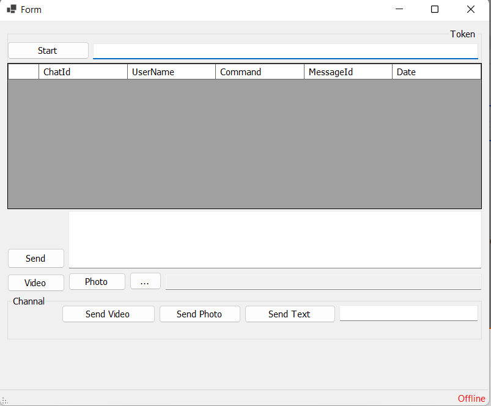

# Telegram Bot Demo

This is a simple demonstration of a Telegram bot implemented in C# using the Telegram.Bot library. The bot allows sending text messages, photos, and videos to specified chat IDs or channels.

### Prerequisites

- Visual Studio or any other C# IDE.
- .NET Framework.

### Getting Started

1. Clone this repository to your local machine.
2. Open the project in Visual Studio.
3. Build the project to restore dependencies.
4. Replace the placeholder token in the `Form` class with your Telegram Bot API token.
5. Run the application.

### Functionality

- **Start Bot**: Enter your bot token and click the "Start" button to start the bot.
- **Send Text Message**: Enter a message and click "Send" to send a text message to the selected chat ID or channel.
- **Send Photo**: Select a photo file and click "Send" to send a photo with an optional caption to the selected chat ID or channel.
- **Send Video**: Select a video file and click "Send" to send a video with an optional caption to the selected chat ID or channel.
- **Select File**: Click "Select File" to choose a file from your system.
- **Send Text to Channel**: Enter a channel ID and a message, then click "Send" to send a text message to the specified channel.
- **Send Photo to Channel**: Enter a channel ID, select a photo file, enter a caption, and click "Send" to send a photo to the specified channel.
- **Send Video to Channel**: Enter a channel ID, select a video file, enter a caption, and click "Send" to send a video to the specified channel.

### Note

- Ensure that you have the necessary permissions to send messages and media to the specified chat IDs or channels.
- Be cautious with sensitive data such as API tokens.
- This demo provides basic functionality and can be extended further according to your requirements.

###

